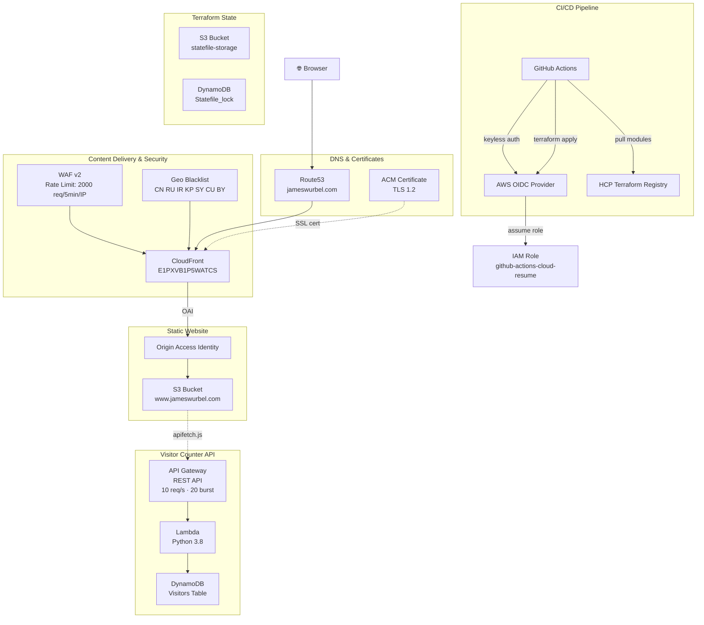

# Cloud Resume Backend Infrastructure

Terraform root configuration for [jameswurbel.com](https://jameswurbel.com). This repo is a thin orchestration layer that calls versioned modules from the [HCP Terraform private registry](https://app.terraform.io/app/Jamesoundb).


## Architecture



### Request Flow

1. Browser resolves `jameswurbel.com` via **Route53**
2. Request hits **CloudFront** — geo-blocked countries are rejected, WAF rate limiting is enforced
3. Static assets served from **S3** via Origin Access Identity
4. Visitor counter JS calls **API Gateway** → **Lambda** → **DynamoDB**

## Modules

All infrastructure is defined through five Terraform modules, each in its own repository and published to the HCP Terraform private registry:

| Module | Registry Source | Version |
|--------|----------------|---------|
| [dynamodb-tables](https://github.com/jamesoundb/terraform-aws-dynamodb-tables) | `app.terraform.io/Jamesoundb/dynamodb-tables/aws` | 1.0.2 |
| [s3-static-website](https://github.com/jamesoundb/terraform-aws-s3-static-website) | `app.terraform.io/Jamesoundb/s3-static-website/aws` | 1.0.0 |
| [lambda-dynamodb-api](https://github.com/jamesoundb/terraform-aws-lambda-dynamodb-api) | `app.terraform.io/Jamesoundb/lambda-dynamodb-api/aws` | 1.0.0 |
| [api-gateway-lambda](https://github.com/jamesoundb/terraform-aws-api-gateway-lambda) | `app.terraform.io/Jamesoundb/api-gateway-lambda/aws` | 1.0.0 |
| [cloudfront-s3-website](https://github.com/jamesoundb/terraform-aws-cloudfront-s3-website) | `app.terraform.io/Jamesoundb/cloudfront-s3-website/aws` | 1.0.2 |

## Repository Structure

```
├── main.tf                    # Module calls (registry sources)
├── variables.tf               # Input variables
├── outputs.tf                 # Root outputs
├── providers.tf               # AWS provider + S3 backend
├── github_oidc.tf             # GitHub Actions OIDC auth (keyless CI/CD)
├── api_throttling.tf          # API Gateway rate limiting
├── s3_statefile.tf            # State bucket + encryption + versioning
├── dynamodb_statelock_iam.tf  # State lock table IAM
├── lambda/
│   └── lambda_function.zip    # Lambda deployment package
├── docs/
│   ├── ARCHITECTURE.md        # Infrastructure diagrams
│   └── QUICK_START.md         # Getting started guide
└── .github/workflows/
    └── terraform.yml          # CI/CD pipeline
```

## CI/CD

GitHub Actions pipeline on push to `main`:

1. **Checkout** — Clone repository
2. **AWS Credentials** — Assume IAM role via GitHub OIDC (no static keys)
3. **Terraform Init** — Download modules from HCP Terraform private registry
4. **Terraform Format** — Automatic formatting of `.tf` files
5. **Terraform Plan** — Preview infrastructure changes
6. **Terraform Apply** — Deploy to AWS (main branch + push events only)

Authentication uses:
- **GitHub OIDC** — Role assumption for AWS (keyless)
- **HCP Terraform API Token** — Registry authentication (stored in GitHub Actions secrets)

## Security

| Layer | Control | Detail |
|-------|---------|--------|
| TLS | Minimum TLS 1.2 | `TLSv1.2_2021` on CloudFront viewer certificate |
| Geo Blocking | Country blacklist | CN, RU, IR, KP, SY, CU, BY blocked at CloudFront edge |
| WAF v2 | Rate limiting | 2000 requests per 5 minutes per IP on CloudFront |
| API Gateway | Throttling | 10 requests/sec steady-state, 20 burst across all methods |
| S3 Origin | OAI | Bucket only accessible through CloudFront Origin Access Identity |
| Auth | GitHub OIDC | Keyless CI/CD — no static AWS credentials |
| State | Encrypted + locked | S3 backend with versioning, DynamoDB state lock |

## AWS Resources

| Service | Resource | Purpose |
|---------|----------|---------|
| S3 | `www.jameswurbel.com` | Static website hosting |
| S3 | `jameswurbel.com-statefile-storage` | Terraform state (encrypted, versioned) |
| CloudFront | `E1PXVB1P5WATCS` | CDN with SSL/TLS termination |
| Route53 | `jameswurbel.com` (zone) | DNS — root + www A records |
| ACM | `54df301a-...` | SSL certificate (DNS validated) |
| WAF v2 | `jameswurbel-com-rate-limit` | Rate-based rule on CloudFront |
| API Gateway | `MyAPI` | REST API for visitor counter (`/visitorcount`) |
| Lambda | `lambda_function` | Visitor count logic (Python 3.8) |
| DynamoDB | `Visitors` | Visitor count storage |
| DynamoDB | `Statefile_lock` | Terraform state locking |
| IAM | `github-actions-cloud-resume` | OIDC role for CI/CD |

## Prerequisites

- [Terraform](https://www.terraform.io/downloads) >= 1.0
- AWS account with Route53 hosted zone
- HCP Terraform account (for private registry access)
- `~/.terraformrc` with HCP Terraform credentials:
  ```hcl
  credentials "app.terraform.io" {
    token = "your-hcp-token"
  }
  ```

## HCP Terraform Private Registry Setup

This repo calls five reusable modules published to the HCP Terraform private registry under the `Jamesoundb` organization. To use these modules:

### Local Development

1. Create or log in to your [HCP Terraform account](https://app.terraform.io)
2. Generate an API token: **Account Settings** → **Tokens** → **Create an API token**
3. Add the token to `~/.terraformrc`:
   ```hcl
   credentials "app.terraform.io" {
     token = "YOUR_HCP_API_TOKEN"
   }
   ```
4. Run `terraform init` — it will authenticate and download modules from the registry

### GitHub Actions CI/CD

The Actions workflow needs the HCP token to download modules. Set it up:

1. Go to your GitHub repo → **Settings** → **Secrets and variables** → **Actions**
2. Create a new secret:
   - **Name:** `TF_API_TOKEN`
   - **Value:** Your HCP Terraform API token
3. The workflow's `Setup Terraform` step uses this token via `cli_config_credentials_token: ${{ secrets.TF_API_TOKEN }}`

> **⚠️ Security:** Never commit your HCP token to version control. Always use GitHub Actions secrets.

## Usage

```bash
terraform init
terraform plan
terraform apply
```

## Related Repositories

| Repo | Purpose |
|------|---------|
| [HTML_Resume](https://github.com/jamesoundb/HTML_Resume) | Frontend — static site deployed to S3 via GitHub Actions |
| [terraform-aws-dynamodb-tables](https://github.com/jamesoundb/terraform-aws-dynamodb-tables) | DynamoDB module |
| [terraform-aws-s3-static-website](https://github.com/jamesoundb/terraform-aws-s3-static-website) | S3 website module |
| [terraform-aws-lambda-dynamodb-api](https://github.com/jamesoundb/terraform-aws-lambda-dynamodb-api) | Lambda module |
| [terraform-aws-api-gateway-lambda](https://github.com/jamesoundb/terraform-aws-api-gateway-lambda) | API Gateway module |
| [terraform-aws-cloudfront-s3-website](https://github.com/jamesoundb/terraform-aws-cloudfront-s3-website) | CloudFront + Route53 + ACM + WAF module |

## License

[MIT](LICENSE)
